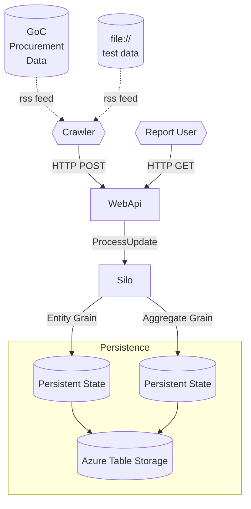

# Government of Canada Tender Notices Analysis

Personal project to track changes to the [Government of Canada's Tender Notices open data set](https://open.canada.ca/data/en/dataset/ffd38960-1853-4c19-ba26-e50bea2cb2d5)

# Getting Started

## Developer Onboarding

* Installations
  * [.NET 7](https://dotnet.microsoft.com/en-us/download/dotnet/7.0)
  * **Visual Studio 2022** version `17.6` or greater. Be sure to check for updates!
    * Extensions:
      * [SwitchStartupProject for VS 2022](https://marketplace.visualstudio.com/items?itemName=vs-publisher-141975.SwitchStartupProjectForVS2022)
      * Open Command Line
  * [VS Code](https://code.visualstudio.com/Download)
    * Extensions:
      * [vscode-base64](https://marketplace.visualstudio.com/items?itemName=adamhartford.vscode-base64)
        * Inline base64 encode/decode selection
      * [REST Client](https://marketplace.visualstudio.com/items?itemName=humao.rest-client)
        * Light-weight Postman replacement.
* Setup PowerShell Local Script execution
  * `Set-ExecutionPolicy -ExecutionPolicy RemoteSigned -Scope CurrentUser`
* Useful Commands
  * Remove Bin/Obj folders: `gci -include bin,obj -recurse | remove-item -force -recurse`
* Set up Azure Table Storage for Grains persistence:
  * Create an environment variable named `goctnorleans` with a connection string for writing grains.

## How to Run

1. Run the Silo: `

# About the Data Set

* [Government of Canada's Tender Notices](https://open.canada.ca/data/en/dataset/ffd38960-1853-4c19-ba26-e50bea2cb2d5)
* Data Set License: [Open Government License - Canada](https://open.canada.ca/en/open-government-licence-canada)

## Files

* [Active (tpsgc-pwgsc_ao-t_a.csv)](https://buyandsell.gc.ca/procurement-data/csv/tender/active)
  * Approx. Size: 7MB
* [Awarded (tpsgc-pwgsc_aa-a.csv)](https://buyandsell.gc.ca/procurement-data/csv/award/all)
  * Approx. Size: 262MB and growing
* [Expired (tpsgc-pwgsc_ao-t_a_b-g.csv)](https://buyandsell.gc.ca/procurement-data/csv/tender/expired)
  * Approx. Size: 203MB and growing
* [New Today (tpsgc-pwgsc_ao-t_n.csv)](https://buyandsell.gc.ca/procurement-data/csv/tender/new-today)

## Feeds & Data Sources

* [Buyandsell.gc.ca/procurement-data](https://buyandsell.gc.ca/procurement-data/)
* [Follow Opportunities](https://buyandsell.gc.ca/procurement-data/tenders/follow-opportunities)
  * Supports Email notifications & RSS/Atom Feeds

Alternative feeds to reduce bandwidth requirements of downloading and re-processing the every-growing Awarded and Expired datasets listed below:

* Awarded Feed [RSS](https://buyandsell.gc.ca/procurement-data/feed?dds_facet_date_published=NOW/DAY-7DAYS%20TO%20NOW/DAY%2B86399999MILLISECONDS&sm_facet_procurement_data=data_data_tender_award&ss_language=en&rss_atom_title=%7B%22sm_facet_procurement_data%22%3A%5B%22data_data_tender_award%22%5D%2C%22dds_facet_date_published%22%3A%5B%22dds_facet_date_published_7day%22%5D%7D) [ATOM](https://buyandsell.gc.ca/procurement-data/feed/atom?dds_facet_date_published=NOW/DAY-7DAYS%20TO%20NOW/DAY%2B86399999MILLISECONDS&sm_facet_procurement_data=data_data_tender_award&ss_language=en&rss_atom_title=%7B%22sm_facet_procurement_data%22%3A%5B%22data_data_tender_award%22%5D%2C%22dds_facet_date_published%22%3A%5B%22dds_facet_date_published_7day%22%5D%7D)
  * Awarded tender notices published in the last 7 days
* Expired Feed [RSS](https://buyandsell.gc.ca/procurement-data/feed?dds_facet_date_published=NOW/DAY-7DAYS%20TO%20NOW/DAY%2B86399999MILLISECONDS&ss_publishing_status=SDS-SS-006&sm_facet_procurement_data=%28tender_notice%20AND%20data_data_tender_notice%29&ss_language=en&rss_atom_title=%7B%22sm_facet_procurement_data%22%3A%5B%22tender_notice%22%2C%22data_data_tender_notice%22%5D%2C%22ss_publishing_status%22%3A%5B%22SDS-SS-006%22%5D%2C%22dds_facet_date_published%22%3A%5B%22dds_facet_date_published_7day%22%5D%7D) [ATOM](https://buyandsell.gc.ca/procurement-data/feed/atom?dds_facet_date_published=NOW/DAY-7DAYS%20TO%20NOW/DAY%2B86399999MILLISECONDS&ss_publishing_status=SDS-SS-006&sm_facet_procurement_data=%28tender_notice%20AND%20data_data_tender_notice%29&ss_language=en&rss_atom_title=%7B%22sm_facet_procurement_data%22%3A%5B%22tender_notice%22%2C%22data_data_tender_notice%22%5D%2C%22ss_publishing_status%22%3A%5B%22SDS-SS-006%22%5D%2C%22dds_facet_date_published%22%3A%5B%22dds_facet_date_published_7day%22%5D%7D)
  * Expired tender notices published in the last 7 days
* Amended Feed [RSS](https://buyandsell.gc.ca/procurement-data/feed?dds_facet_date_amended=NOW/DAY-7DAYS%20TO%20NOW/DAY%2B86399999MILLISECONDS&sm_facet_procurement_data=%28tender_notice%20AND%20data_data_tender_notice%29&ss_language=en&rss_atom_title=%7B%22sm_facet_procurement_data%22%3A%5B%22tender_notice%22%2C%22data_data_tender_notice%22%5D%2C%22dds_facet_date_amended%22%3A%5B%22dds_facet_date_amended_7day%22%5D%7D) [ATOM](https://buyandsell.gc.ca/procurement-data/feed/atom?dds_facet_date_amended=NOW/DAY-7DAYS%20TO%20NOW/DAY%2B86399999MILLISECONDS&sm_facet_procurement_data=%28tender_notice%20AND%20data_data_tender_notice%29&ss_language=en&rss_atom_title=%7B%22sm_facet_procurement_data%22%3A%5B%22tender_notice%22%2C%22data_data_tender_notice%22%5D%2C%22dds_facet_date_amended%22%3A%5B%22dds_facet_date_amended_7day%22%5D%7D)
  * Tender notices amended in the last 7 days
* Active Feed [RSS](https://buyandsell.gc.ca/procurement-data/feed?dds_facet_date_published=NOW/DAY-7DAYS%20TO%20NOW/DAY%2B86399999MILLISECONDS&ss_publishing_status=SDS-SS-005&sm_facet_procurement_data=%28tender_notice%20AND%20data_data_tender_notice%29&ss_language=en&rss_atom_title=%7B%22sm_facet_procurement_data%22%3A%5B%22tender_notice%22%2C%22data_data_tender_notice%22%5D%2C%22dds_facet_date_published%22%3A%5B%22dds_facet_date_published_7day%22%5D%2C%22ss_publishing_status%22%3A%5B%22SDS-SS-005%22%5D%7D) [ATOM](https://buyandsell.gc.ca/procurement-data/feed/atom?dds_facet_date_published=NOW/DAY-7DAYS%20TO%20NOW/DAY%2B86399999MILLISECONDS&ss_publishing_status=SDS-SS-005&sm_facet_procurement_data=%28tender_notice%20AND%20data_data_tender_notice%29&ss_language=en&rss_atom_title=%7B%22sm_facet_procurement_data%22%3A%5B%22tender_notice%22%2C%22data_data_tender_notice%22%5D%2C%22dds_facet_date_published%22%3A%5B%22dds_facet_date_published_7day%22%5D%2C%22ss_publishing_status%22%3A%5B%22SDS-SS-005%22%5D%7D)
  * Active tender notices published in the last 7 days.

# Project Definition

:wawrning: What follows in this section is a draft and may not perfectly match implementation. It is a rough design subject to change.

* Inputs
  * **Common**
    * All RSS feeds have the following format:
      * Channel
        * Item
          * Title
          * Link
          * Description
          * Flags (Dictionary<string, string>)
          * pubDate (Assumes is date added to current feed)
          * creator
          * feedGuid (uses string, not Guid type)
            * This will be the Grain Id.
            * Can exclude "news", "page", "event" guids.
              * All others by default, should include only "data_data_sosa" values.
              * If other types, add automatically.
  * **Awarded** RSS
    * Status: Awarded (inferred from input)
  * **Active** RSS
    * Status: Active (inferred from input)
  * **Expired** RSS
    * Status: Expired (inferred from input)
  * **Amended** RSS
    * Status: Whatever. But status is not changed. Also does not insert records. Assumes only records we already know about will be amended.
* Gaps
  * Assumes no prior history is relevant.
  * Awarded, Amended, Expired may be for prior history and this behaviour is untested. (See prior gap.)
  * Tender notices are not "deactivated" or cleaned up after a while. This system may not be suited for long-term large datasets as a result.

## Mermaid Flowchart

# Technical Reference

## .NET

* [Worker services in .NET](https://learn.microsoft.com/en-us/dotnet/core/extensions/workers?pivots=dotnet-7-0)
* [Configuration](https://learn.microsoft.com/en-us/dotnet/core/extensions/configuration)
* [Tutorial: Create a web API with ASP.NET Core](https://learn.microsoft.com/en-us/aspnet/core/tutorials/first-web-api?view=aspnetcore-7.0&tabs=visual-studio)

## Automapper

* [Automapper Home](https://automapper.org/)
* [Getting Started](https://docs.automapper.org/en/latest/Getting-started.html)
* [Dependency Injection](https://docs.automapper.org/en/latest/Dependency-injection.html)
* [Configuration Profiles](https://docs.automapper.org/en/latest/Configuration.html#profile-instances)
* [Projection](https://docs.automapper.org/en/latest/Projection.html)

## Orleans

* [Orleans Best Practices](https://learn.microsoft.com/en-us/dotnet/orleans/resources/best-practices)
* [Orleans Tutorials and Samples](https://learn.microsoft.com/en-us/dotnet/orleans/tutorials-and-samples/tutorial-1?source=recommendations)
  * Consider using State instead of a database.
* [Github: Orleans Samples](https://github.com/dotnet/samples/blob/main/orleans/)
  * [Sample communication across grains](https://github.com/dotnet/samples/blob/main/orleans/TicTacToe/Grains/GameGrain.cs)
* Persistence
  * [Custom Grain Storage](https://learn.microsoft.com/en-us/dotnet/orleans/tutorials-and-samples/custom-grain-storage?pivots=orleans-7-0)
  * [Grain Persistence](https://learn.microsoft.com/en-us/dotnet/orleans/grains/grain-persistence/?pivots=orleans-7-0)
  * [Serialization Surrogates](https://learn.microsoft.com/en-us/dotnet/orleans/host/configuration-guide/serialization?pivots=orleans-7-0#surrogates-for-serializing-foreign-types)
* [Orleans Transactions](https://learn.microsoft.com/en-us/dotnet/orleans/grains/transactions)

### Troubleshooting Orleans

* Persistence requires State class to have [GenerateSerializer] attribute and all properties to be serialized to be annotated with the `[Id(#)]` attribute. [Source](https://github.com/dotnet/orleans/releases/tag/v4.0.0-preview1) has an example in Breaking Changes.
  * See also: [Orleans Serialization Overview](https://learn.microsoft.com/en-us/dotnet/orleans/host/configuration-guide/serialization?pivots=orleans-7-0#use-orleans-serialization)
* Force serialization to use Newtonsoft or System.Text.Json: [Configure Serialization](https://learn.microsoft.com/en-us/dotnet/orleans/host/configuration-guide/serialization-configuration?pivots=orleans-7-0)
  * Unclear why persistence doesn't work as-is but this confirmed works.
* Fix for `System.InvalidOperationException: Unable to resolve service for type 'Orleans.Runtime.IPersistentState`:
  * Install Nuget Package `Microsoft.Orleans.Runtime` into Client and Silo projects. [Source](https://github.com/dotnet/orleans/issues/8178)

